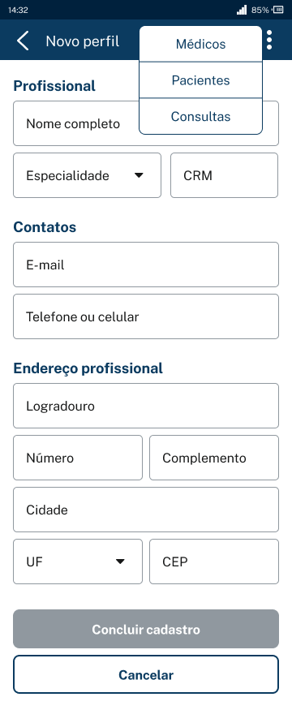

<h1 align="center">
  
</h1>

API Rest em JAVA da aplicação Voll.med com o intuito de cadastrar médicos e pacientes, além de agendar consultas.

- Sprint Boot 3.
- Banco de Dados MySQL.
- Maven como gerenciador de dependências.
- Flyway como ferramenta de Migrations.
- Lombok para produtividade e redução de código boilerplate.
- Bean Validation para validações.

<h1 align="center">
  
</h1>

## Requisitos
**Cadastro de médicos**

O sistema deve possuir uma funcionalidade de cadastro de médicos, na qual as seguintes informações deverão ser preenchidas:

- [x] Nome
- [x] E-mail
- [x] Telefone
- [x] CRM
- [x] Especialidade (Ortopedia, Cardiologia, Ginecologia ou Dermatologia)
- [x] Endereço completo (logradouro, número, complemento, bairro, cidade, UF e CEP)

```shell
Todas as informações são de preenchimento obrigatório, exceto o número e o complemento do endereço.
```

<h1 align="center">
  
</h1>

**Listagem de médicos**

O sistema deve possuir uma funcionalidade de listagem de médicos, na qual as seguintes informações, de cada um dos médicos cadastrados, deverão ser exibidas:

- [x] Nome
- [x] E-mail
- [x] CRM
- [x] Especialidade (Ortopedia, Cardiologia, Ginecologia ou Dermatologia)

```shell
A listagem deve ser ordenada pelo nome do médico, de maneira crescente, bem como ser paginada, trazendo 10 registros por página.
```

``
/medicos?size=2&page=0&sort=nome
``

<h1 align="center">
  
</h1>
